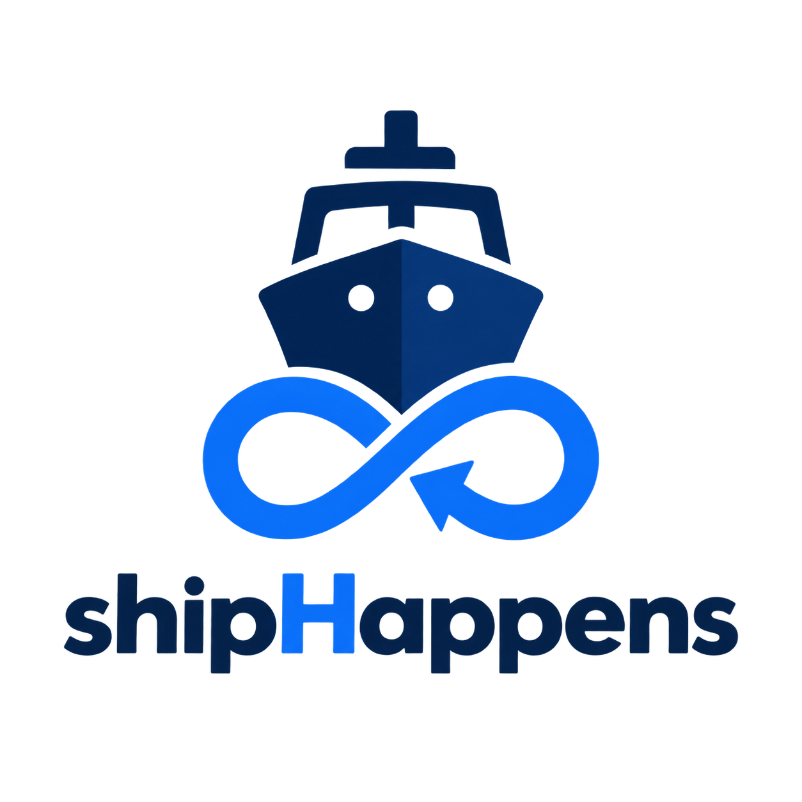

<div align="center">



# Ship Happens

### Local-first CI that fails in **milliseconds**, not 14 minutes.

A GitHub Actions–style pipeline runner in Go. Pipelines are **code** — authored
in [Pkl](https://pkl-lang.org) (or a Go DSL / JSON) — compiled to a validated
plan, and run **on your machine** as a parallel DAG: content-addressed caching,
incremental resume, containers or native, secrets, a live TUI, an **MCP server**
for agents, and **actually-enforced** network egress.

<br/>

[](ci/pipeline.pkl)
[](go.mod)
[](Makefile)
[](ci/pipeline.pkl)
[](go.mod)
[](go.mod)

[**Quickstart**](#-quickstart) ·
[**Why**](#-why-ship-happens) ·
[**Features**](#-features) ·
[**MCP for agents**](#-mcp--drive-ci-from-your-agent) ·
[**Native toolchains**](#-reproducible-native-toolchains-no-container) ·
[**Install**](#-install) ·
[**Docs**](docs/DX.md)

</div>

---

## ⚡ Quickstart

A pipeline is a **Pkl** file. This one checks out, lints and tests in parallel,
then builds — with caching, a container job, a retry, and a masked secret:

```pkl
amends "pkl/ship.pkl"

name = "CI"
vars { ["REGION"] = "eu-west" }

jobs {
  ["checkout"] { steps { new { id = "clone"; run = "git rev-parse HEAD" } } }

  ["lint"] {
    needs { "checkout" }
    image = "golang:1.22-alpine"       // runs in a container
    steps { new { id = "vet"; run = "go vet ./..."; cache { inputs { "**/*.go" } } } }
  }
  ["test"] {
    needs { "checkout" }
    steps { new { id = "unit"; run = "go test ./..."; retries = 2 } }   // flaky-test resilience
  }
  ["build"] {
    needs { "lint"; "test" }
    secrets { new { name = "NPM_TOKEN" } }   // from $NPM_TOKEN, masked in logs
    steps { new { id = "compile"; run = "go build -o bin/app ./...";
                  cache { inputs { "**/*.go" }; outputs { "bin/**" } } } }
    outputs { "bin/**" }                     // restored instantly on --resume
  }
}
```

Run it — and watch the DAG light up in the live TUI:

```bash
ship run pipeline.pkl            # compile → validate → run (lint ∥ test, then build)
ship run pipeline.pkl --graph    # just print the DAG
ship run pipeline.pkl --resume   # skip unchanged jobs, restore their outputs
ship run pipeline.pkl --job test # run one job (+ its deps)
ship run pipeline.pkl --changed  # only jobs affected by git changes
ship run pipeline.pkl --tui      # live dashboard
```

```
⚓ CI   elapsed 3s
  ✓ checkout   done 120ms
  ✓ lint       done 1.5s
  ▶ test       running · unit 2s
  · build      pending
  ▸ 2 done · 1 running · 1 pending
```

> `ship run` evaluates the Pkl with the `pkl` CLI (`brew install pkl`), validates
> the DAG, and executes it. Pipelines can **also** be authored as a Go program or
> raw JSON plan — all lower to the same engine
> ([docs/DX.md §13](docs/DX.md#13-also-available-go-dsl--json)).

---

## 🧭 Why Ship Happens

|  | |
|---|---|
| 🚦 **Compile before execute** | Parse, validate, and check the DAG for cycles up front, with `file:line` diagnostics. No discovering a typo after 11 minutes. |
| 💻 **Local is the default** | Reproduce CI on your machine — native, or in containers (Docker / Podman / Apple `container`). |
| ⚡ **Cache everything safe** | Content-addressed step cache **plus** job-level resume: skip whole unchanged jobs and restore their artifacts. |
| 🧵 **Fast by design** | Parallel DAG across every core; `--changed` runs only what git touched. |
| 📐 **Typed, declarative** | Pipelines in Pkl (sandboxed, reviewable). A Go DSL and raw JSON plans lower to the same engine. |
| 🧰 **Reproducible, no container** | Pin exact tool/SDK versions (Go, Node, Python, **PlatformIO**, **Flutter**, …) that run natively — container-grade pinning without the daemon. |
| 🔒 **Actually secure** | Offline-by-default containers and egress allow-lists **enforced by a filtering proxy** — not just documented. |
| 🤖 **Agent-native** | A built-in MCP server lets agents/IDEs validate, run (async), and poll pipelines. |
| 🪶 **Zero runtime deps** | Pure Go standard library. One static binary. |

---

## ✨ Features

<table>
<tr>
<td valign="top" width="33%">

**Graph & execution**
- Jobs & DAG, parallel scheduling
- **Step sub-graphs** (`needs` + `onFailure`)
- Matrix fan-out
- `if:` conditionals & job/step **outputs**
- **timeouts** · **retries** · continue-on-error
- `--changed` (git-aware) · `--job` · `--resume`

</td>
<td valign="top" width="33%">

**Execution environments**
- Containers (docker / podman / apple)
- **Native versioned toolchains** (mise)
- overlayfs isolation
- **services** (sidecar containers)
- step-level env / workdir / shell
- preheating & `CleanAfter` pruning

</td>
<td valign="top" width="33%">

**Caching, security & DX**
- Content-addressed **step cache**
- **Job resume** + cache **GC**
- Host-sourced **secrets** (masked)
- **Enforced egress allow-lists**
- Live **TUI** · **live notifications**
- **MCP server** · reusable **Pkl templates**

</td>
</tr>
</table>

<div align="center">

📊 See the full [**GitHub Actions gap analysis**](docs/gha-gap-analysis.md) · 📖 Every feature in the [**DX reference**](docs/DX.md)

</div>

---

## 🤖 MCP — drive CI from your agent

Ship ships an [**MCP**](https://modelcontextprotocol.io) server (`ship-mcp`) so
agents and MCP-aware IDEs can drive pipelines over stdio. Register it:

```jsonc
{ "mcpServers": { "shiphappens": { "command": "ship-mcp" } } }
```

| Tool | What it does |
|---|---|
| `ship_docs` | Return authoring docs — a Pkl quickref, the full `schema`, `templates`, or the `dx` guide |
| `ship_scaffold` | Write a valid starter `pipeline.pkl` into any directory |
| `ship_validate` | Compile + validate a pipeline (diagnostics) |
| `ship_graph` | Return the job dependency graph |
| `ship_run` | Start a run **in the background**, return a `runId` immediately |
| `ship_status` | Poll job/step progress — **read-only, never re-triggers work** |
| `ship_cancel` · `ship_runs` · `ship_cache_du` | Cancel · list runs · cache usage |

It also exposes the schema, templates, and DX guide as **MCP resources**
(`shiphappens://schema`, `…/templates`, `…/dx`, `…/quickref`). So an agent can
**author a pipeline from scratch in any repo**: read `ship_docs`, `ship_scaffold`
a starter, edit it, then `ship_validate` — no prior knowledge of the schema
needed.

The async **`ship_run` → `ship_status`** split is the key: an agent starts a run
and polls on its own cadence, never blocking and never accidentally re-running
(status is a pure in-memory snapshot fed by live scheduler events).

> **Authoring in another repo?** `ship_scaffold` vendors the schema next to the
> pipeline (`.ship/ship.pkl` + `templates.pkl`, embedded in the binary), so a
> scaffolded `pipeline.pkl` validates immediately — no network, no auth. (If the
> schema is ever published as a public Pkl package, `amends "package://…/ship@1"`
> is the zero-vendoring alternative.)

---

## 🧰 Reproducible native toolchains (no container)

Pin exact tool versions per workflow or per job and Ship runs steps **natively** —
no image, no Docker daemon — with those exact versions on the step `PATH`.
Backed by [mise](https://mise.jdx.dev): Ship installs the pinned versions
(cached under `~/.local/share/mise`) and prepends their bin dirs. It's
container-grade version pinning without the container.

```pkl
amends ".ship/ship.pkl"
name = "Reproducible"

// Pin workflow-wide; a job may override with its own.
toolchain { ["go"] = "1.22.5" }

jobs {
  ["build"] {
    steps { new { id = "compile"; run = "go build ./..." } }
  }
  ["legacy"] {
    toolchain { ["go"] = "1.21.13" }   // per-job override
    steps { new { id = "check"; run = "go version" } }
  }
}
```

The `toolchain` key is passed to mise verbatim, so **any mise backend** works as
the key — not just the built-in tools. That means you can pin whole SDK stacks:

| Use case | Pin it as | Verified |
|---|---|:---:|
| Go / Node / Python / Rust | `["go"]="1.22.5"`, `["node"]="20.11.0"`, `["python"]="3.12.4"` | ✅ |
| **PlatformIO** (embedded/firmware) | `["pipx:platformio"] = "6.1.11"` → `pio run` | ✅ |
| **Flutter + Dart** (mobile) | `["flutter"] = "3.24.0"` → `flutter build …` | ✅ |
| Android SDK / Gradle / Java / Kotlin | `["java"]`, `["gradle"]`, `["vfox:android-sdk"]`, `["kotlin"]` | mise-supported |
| iOS helpers | `["gem:cocoapods"]`, `["aqua:XcodesOrg/xcodes"]` | mise-supported |
| Any pipx / npm / cargo / gem / aqua tool | `["pipx:…"]`, `["npm:…"]`, `["cargo:…"]`, `["gem:…"]`, `["aqua:…"]` | ✅ |

<details>
<summary><b>PlatformIO — a firmware build, natively pinned</b></summary>

```pkl
toolchain { ["pipx:platformio"] = "6.1.11" }
jobs {
  ["firmware"] {
    steps {
      new { id = "build"; run = "pio run -e myenv"
            cache { inputs { "src/**"; "platformio.ini" }; outputs { ".pio/build/**" } } }
      new { id = "test"; run = "pio test" }
    }
  }
}
```

</details>

<details>
<summary><b>Flutter — build Android & iOS, natively pinned</b></summary>

```pkl
toolchain { ["flutter"] = "3.24.0" }   // brings Dart 3.5.0
jobs {
  ["analyze"] { steps { new { id = "a"; run = "flutter analyze" } } }
  ["test"]    { steps { new { id = "t"; run = "flutter test" } } }
  ["android"] {
    needs { "analyze"; "test" }
    steps { new { id = "apk"; run = "flutter build apk --release"
                  cache { outputs { "build/app/outputs/**" } } } }
  }
  ["ios"] {
    needs { "analyze"; "test" }
    steps { new { id = "ipa"; run = "flutter build ios --release --no-codesign" } }
  }
}
```

</details>

> **What's reproducible, honestly:** the **tool/SDK versions** you pin are exact
> and cached. iOS builds still need macOS + Xcode (Apple's licensing keeps Xcode
> off mise — pin the rest and use `xcodes` to select an Xcode). Anything a tool
> then fetches at build time (PlatformIO platform packages, Flutter's Android
> SDK/NDK, Gradle deps) should be pinned in its own manifest (`platformio.ini`,
> `pubspec.lock`, Gradle) and cached with step `cache` inputs/outputs. This is
> **container-grade *version* pinning natively** — for a pinned OS/libc too, a
> container image is still the stronger guarantee (Ship supports both).

Requires `mise` on PATH (`brew install mise`); without it Ship warns and falls
back to host tools.

---

## 📦 Install

Install the `ship` CLI (Pkl pipelines also need the [`pkl`](https://pkl-lang.org)
CLI — e.g. `brew install pkl`).

<details open>
<summary><b>Install script</b> (prebuilt binary from a GitHub Release)</summary>

```bash
curl -fsSL https://raw.githubusercontent.com/KochC/shipHappens/main/install.sh | bash
# pin a version / dir:
curl -fsSL .../install.sh | VERSION=v0.1.0 BINDIR=~/.local/bin bash
```

The repo is currently **private**, so the script downloads via the GitHub CLI
(`gh auth login`) when available, or a `GITHUB_TOKEN`:

```bash
gh auth login                                   # once
curl -fsSL https://raw.githubusercontent.com/KochC/shipHappens/main/install.sh | bash
# or:  GITHUB_TOKEN=ghp_… bash install.sh
```

</details>

<details>
<summary><b>With Go</b> (handles private repos via your git auth)</summary>

```bash
go install github.com/KochC/shipHappens/cmd/ship@v0.1.0   # or @latest
```

</details>

<details>
<summary><b>Prebuilt binaries</b> & companion tools</summary>

Grab a `ship_<version>_<os>_<arch>` asset from the
[Releases page](https://github.com/KochC/shipHappens/releases) (checksums in
`checksums.txt`). Two companion binaries are published alongside `ship`:

- **`ship-mcp`** — the [MCP](https://modelcontextprotocol.io) server for agents/IDEs (`{ "command": "ship-mcp" }`).
- **`ship-egress`** — the egress-filtering proxy Ship starts automatically to enforce a job's `allow` list.

Neither is required for normal `ship run` use.

</details>

```bash
ship version
ship run pipeline.pkl
```

---

## 🧪 Try the demos

Every demo comes in **two forms** — the Go DSL program and an equivalent **Pkl**
pipeline (`demos/<name>/pipeline.pkl`), both lowering to the same engine:

```bash
# Go DSL
go run ./demos/demo1        # parallel fan-out/fan-in (TUI)
go run ./demos/demo2        # fail-fast: a job fails, dependents skipped
go run ./demos/demo3        # resume: run twice, second is instant
go run ./demos/matrix-app   # matrix, retries, timeouts, continue-on-error
go run ./demos/python-app   # real ruff + pytest + wheel in a container
go run ./demos/go-app       # real go vet + test + build in a container
go run ./demos/vue-app      # real npm + vitest + vite build in a container
DEPLOY_TOKEN=sk-x go run ./demos/secrets-app   # variables + masked secrets

# Pkl (same pipelines — also runnable via the ship-mcp MCP server)
ship run demos/demo1/pipeline.pkl --tui
ship run demos/matrix-app/pipeline.pkl
DEPLOY_TOKEN=sk-x ship run demos/secrets-app/pipeline.pkl
ship run demos/pkl-app/pipeline.pkl            # bespoke Pkl demo
ship run demos/reusable-app/pipeline.pkl       # composed from reusable templates
ship run demos/toolchain-app/pipeline.pkl      # native pinned tool versions (needs mise)
```

See [demos/README.md](demos/README.md) for details.

---

## 🔨 Build & test

Ship Happens **builds itself** — its own CI is a Ship Happens pipeline
([`ci/pipeline.pkl`](ci/pipeline.pkl)): a static-analysis **lint** job
(gofmt + staticcheck + govulncheck) alongside vet → test (race) ∥ coverage gate
→ build the `ship` CLI → validate the demo pipelines (including itself).

```bash
go build -o bin/ship ./cmd/ship
./bin/ship run ci/pipeline.pkl        # 🚢 ship builds ship
```

Or the raw targets:

```bash
make               # vet + test
make cover-check   # 95% coverage gate
make integration   # container-backed tests (needs Docker)  [ENGINE=docker|podman|apple]
make pkl-test      # Pkl integration (needs the pkl CLI)
```

### Git hooks (dogfooded)

Ship Happens gates its own commits with version-controlled hooks in
[`.githooks/`](.githooks). Enable them once:

```bash
make hooks         # sets core.hooksPath=.githooks
```

- **pre-commit** (fast, ~1–2s): `gofmt` on staged files + `go build` + `go vet`.
- **pre-push**: dogfoods the tool — `ship run ci/precommit.pkl` (vet + race
  tests), mirroring what CI checks first. The full coverage gate stays in CI.

Bypass in a pinch with `git commit/push --no-verify`.

---

## 📚 Documentation

| Doc | What's inside |
|---|---|
| 📖 [**docs/DX.md**](docs/DX.md) | Developer experience & full feature guide + Pkl schema reference |
| 🏗️ [**SPEC.md**](SPEC.md) | System specification — architecture, IR, execution model |
| 📊 [**docs/gha-gap-analysis.md**](docs/gha-gap-analysis.md) | Feature-by-feature GitHub Actions comparison |
| 🚀 [**docs/RELEASING.md**](docs/RELEASING.md) | Cut releases locally (auto-versioned) — replaces GitHub Actions |
| 🧭 [**docs/adr/**](docs/adr/) | Architecture decision records |

<div align="center">
<br/>
<sub>Built with Go, zero runtime dependencies, and a healthy fear of 14-minute CI feedback loops. 🚢</sub>
</div>
